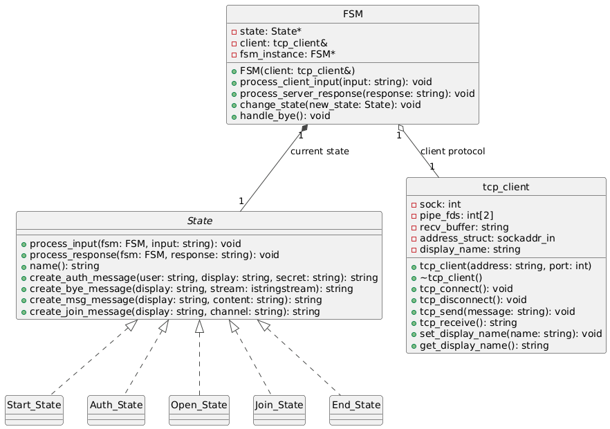
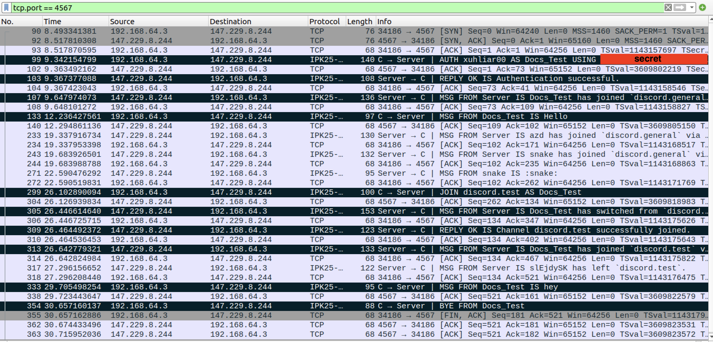

# IPK Project 2: Client for a chat server using the IPK25-CHAT protocol

[](https://www.gnu.org/licenses/gpl-3.0)

---

In this project I implemented a client application that can communicate with a remote server using the IPK25-CHAT protocol.

---

## Table of Contents
- [IPK Project 2: Client for a chat server using the IPK25-CHAT protocol](#ipk-project-2-client-for-a-chat-server-using-the-ipk25-chat-protocol)
- [Table of Contents](#table-of-contents)
- [Executive Summary](#executive-summary)
- [Theory of Operation](#theory-of-operation)
- [Class Diagram](#class-diagram)
- [Implementation Details](#implementation-details)
- [Testing](#testing)
  - [Test environment](#test-environment)
  - [Unit Tests](#unit-tests)
  - [Wireshark observation](#wireshark-observation)
  - [Valgrind](#valgrind)
- [Extra Functionality](#extra-functionality)
  - [Command /bye](#command-bye)
- [Bibliography](#bibliography)

---

## Executive Summary
The functionality of this program is to receive and send messages with server. The messages are handled according to the state that the client is in following a mealy machine (finite state machine).

---

## Theory of Operation
The program uses IPK25-CHAT protocol that is implemented on top of TCP or UDP.

TCP or Transmission Control Protocol provides reliable and ordered delivery of a stream between applications. [1](#ref1)

UDP or User Datagram Protocol is a connectionless protocol which means it does not keep track of what was sent. This can be handled by sending confirmations that the message was received. [2](#ref2)

Socket is an unique identifier for transmitting information in a network. The socket is specified as number with even numbers identifying receiving sockets and odd numbers identifying sending sockets. It is also identified by the host and port number. In any case, communication over the network is from one socket to another socket. [3](#ref3)

---

## Class Diagram


---

## Implementation Details
### Code Structure
Below is output of `tree` command in project directory with comments regarding files.
```bash
tree
.
├── LICENSE # GPL-3 License
├── Makefile
├── README.md
├── images  # Contains images for this readme
│   ├── class_diagram.png
│   └── wireshark.png
├── src     # Contains project source code
│   ├── arguments.cpp # Argument parsing
│   ├── arguments.hpp
│   ├── fsm.cpp # FSM implementation and states
│   ├── fsm.hpp
│   ├── ipk25chat-client.cpp # Main file
│   ├── macro.hpp # Macro from the assignment
│   ├── tcpclient.cpp # Connection handling
│   └── tcpclient.hpp
└── tests
    ├── catch.hpp # Tests header file more in Unit Tests
    └── tests.cpp # Unit Tests
```

>macro.hpp [5](#ref5)

### How it works
After starting the program is parses the arguments and resolves the server address. This information in saved in arguments structure.
Next the tcp_client is constructed with the provided address and port.
Next the tcp_client is connected to the server and the FSM is initialized with this client.

Now there is select monitoring file descriptors for the client socket, standard input and a pipe that i use for quitting.

The FSM instance has a unique pointer with base class State that points to the current state. The other states are derived from this base class that has virtual methods.

The most important functions are `process_input` and `process_response`. When there is input from the user the fsm calls it's function `process_client_input` that calls the state's `process_input` function. And when there is response from the server the fsm calls it's function `process_server_response` that calls the state's `process_response` function. The state's is changed during the program execution but since it's derived from the base class there is no need to do any magic in the main function because the fsm will always have the current state.

I mentioned the pipe file descriptor, it is used in the end state in order to quit the program. End state writes a letter to it and that triggers the select in the main that breaks the loop.

Bye message from the client is sent in the tcp_client destructor which happens at the end of the program.

---

## Testing
### Test environment

### Unit Tests
The program was testing with Catch Unit Testing Framework. I decided to use catch because it needs just a single header file to work. Also i read about it in *C++ Crash Course* [4](#ref4) and decided to give it a try. The code snippets would be too long so some parts are replaced with `...` the full code can be found in tests directory.

### What was tested

---

### Argument parsing
This was tested so i could verify that the argument parsing was implemented correctly.
This is one example of how it was tested.
```c++
TEST_CASE("Default arguments values", "[cli]") {
    const char* argv[] = { "ipk25chat_client", "-t", "tcp", "-s", "127.0.0.1"};
    int argc = sizeof(argv) / sizeof(argv[0]);

    arguments args(argc, const_cast<char**>(argv));

    REQUIRE(args.transport_protocol == "tcp");
    REQUIRE(args.address == "127.0.0.1");
    REQUIRE(args.port == 4567);
    REQUIRE(args.timeout == 250);
    REQUIRE(args.max_retries == 3);
}
```
---

### Message creation
This was tested to ensure that the grammar was used correctly.
This is one example of how it was tested.
```c++
TEST_CASE("Create message", "[fsm]") {
    MockState state;
    std::string display_name = "test_name";
    std::string message_content = "This is a test message";

    std::string token;
    token = state.create_msg_message(display_name, message_content);

    REQUIRE(token == "MSG FROM test_name IS This is a test message\r\n");
}
```
---

### Simulated server communication
This was tested to see if program sends and receives messages correctly.
This is one example of how it was tested.
```c++
TEST_CASE("Authentication with OK Reply", "[tcp_client]") {
                    ...
                    ...
    std::string auth = state.create_auth_message("test_username", "test_name", "test_secret");
    client.tcp_send(auth);
    std::string buffer = server.receive_message();
    REQUIRE(buffer == "AUTH test_username AS test_name USING test_secret\r\n");

    server.send_message("REPLY OK IS Authentication successful\r\n");
                    ...
                    ...
    REQUIRE(output == "Action Success: Authentication successful\n");
    }
```
---

### Correct quitting
This was tested to ensure that the program sends bye message when the user quits.
This is one example of how it was tested.
```c++
TEST_CASE("Bye in Start_State", "[tcp_client]") {
    Server server(4567);
    tcp_client client("127.0.0.1", 4567);
    client.tcp_connect();
    FSM fsm(client);
    server.accept_client();
    Start_State state;
    server.send_message("BYE FROM test_server\r\n");
    std::string response = client.tcp_receive();
    REQUIRE(response == "BYE FROM test_server\r\n");
}
```

---

### Grammar case insensitivity
This was tested to see if program can handle when server sends a message with different capitalization.
This is one example of how it was tested.
```c++
TEST_CASE("Grammar insensitivity", "[tcp_client]") {
                        ...
                        ...
    server.send_message("RePlY oK iS Authentication successful\r\n");
                        ...
                        ...
    server.send_message("MsG FroM dog iS haf haf\r\n");
    response = client.tcp_receive();
    open_state.process_response(fsm, response);
                        ...
    REQUIRE(output == "Action Success: Authentication successful\ndog: haf haf\n");
                        ...
                        ...
}
```

---

### Receiving messages in invalid state
This was tested to see if program writes correct error messages and sends the error message to the server.
This is one example of how it was tested.
```c++
TEST_CASE("Received message in Auth_State", "[tcp_client]") {
                        ...
                        ...
    std::string auth = state.create_auth_message("test_username", "test_name", "test_secret");
    client.tcp_send(auth);

    std::string buffer = server.receive_message();

    REQUIRE(buffer == "AUTH test_username AS test_name USING test_secret\r\n");
                        ...
    Auth_State auth_state;

    server.send_message("MSG FROM cat IS meow you should not see this message in auth state\r\n");
                        ...
                        ...
    REQUIRE(buffer == "ERR FROM unknown IS Message received in auth state.\r\n");
}
```
---

### Message segmentation
This was tested to see what program does when a message is send in multiple packets.
This is one example of how it was tested.
```c++
TEST_CASE("Received message in 2 segments", "[tcp_client]") {
                        ...
                        ...
    std::string message = open_state.create_msg_message("test_username", "meeeow meow");
    client.tcp_send(message);

    buffer = server.receive_message();
    REQUIRE(buffer == "MSG FROM test_username IS meeeow meow\r\n");

    server.send_message("MSG FROM dog ");
    server.send_message("IS haf haf\r\n");
                        ...
    REQUIRE(output == "Action Success: Authentication successful\ndog: haf haf\n");
                        ...
}
```

---

### List of all unit tests
```c++
TEST_CASE("Default arguments values", "[cli]");
TEST_CASE("Custom arguments TCP", "[cli]");
TEST_CASE("Custom arguments UDP", "[cli]");
TEST_CASE("Required arguments not provided", "[cli]");
TEST_CASE("Create message", "[fsm]");
TEST_CASE("Message is shortened if its longer than max length", "[fsm]");
TEST_CASE("Create auth message", "[fsm]");
TEST_CASE("Create join message", "[fsm]");
TEST_CASE("Authentication with OK Reply", "[tcp_client]");
TEST_CASE("Authentication with NOK Reply", "[tcp_client]");
TEST_CASE("Error in Start_State", "[tcp_client]");
TEST_CASE("Bye in Start_State", "[tcp_client]");
TEST_CASE("Authenticated Message send and receive", "[tcp_client]");
TEST_CASE("Grammar insensitivity", "[tcp_client]");
TEST_CASE("Received message in Auth_State", "[tcp_client]");
TEST_CASE("Received message from server missing \r\n", "[tcp_client]");
TEST_CASE("Received message in 2 segments", "[tcp_client]");
TEST_CASE("Authenticated Join", "[tcp_client]");
TEST_CASE("Segmented join reply", "[tcp_client]");
TEST_CASE("Authenticated Join Error", "[tcp_client]");
```
---

### Wireshark observation
In the screenshot below is a conversation captured in Wireshark. Showing that the program handles commands correctly and sends bye message when the user quits.
```
Firstly i wrote a command to authenticate the user
/auth xuhliar00 <seceret> Docs_Test
After this i wrote a message
Hello
Then i joined channel discord.test and send message
/join discord.test
hey
After this i used the command to quit.
/bye
```
> The quiting can also be done using Ctrl+C or Ctrl+D which is end of client input. In this example i used the command /bye, that will be mentioned in Extra Functionality.



---

### Valgrind
When running the program with valgrind and using the same commands as in the Wireshark observation this is the valgrind output. It shows that there are no leaks.
```
==18095==
==18095== HEAP SUMMARY:
==18095==     in use at exit: 0 bytes in 0 blocks
==18095==   total heap usage: 291 allocs, 291 frees, 122,005 bytes allocated
==18095==
==18095== All heap blocks were freed -- no leaks are possible
==18095==
==18095== For lists of detected and suppressed errors, rerun with: -s
==18095== ERROR SUMMARY: 0 errors from 0 contexts (suppressed: 0 from 0)
```

---

## Extra Functionality

### Command /bye
There is `/bye` command available that user can use in any state that will quit the program. The command quits the same was as Ctrl+C or Ctrl+D would.


---

## Bibliography

<a id="ref1"></a> [1]: [Transmission Control Protocol], Available: https://en.wikipedia.org/wiki/Transmission_Control_Protocol

<a id="ref2"></a> [2]: [User Datagram Protocol], Available: https://en.wikipedia.org/wiki/User_Datagram_Protocol

<a id="ref3"></a> [3]: [RFC147 - The Definition of a Socket], Available: https://www.rfc-editor.org/rfc/rfc147

<a id="ref4"></a> [4]: [Josh Lospinoso, C++ Crash Course], Chapter 10 Testing - Unit-Testing and Mocking Frameworks

<a id="ref5"></a> [5]: [IPK Project 2: Client for a chat server using the IPK25-CHAT protocol], Macro, Available: https://git.fit.vutbr.cz/NESFIT/IPK-Projects/src/branch/master/Project_2#example-of-client-logging-in-c
